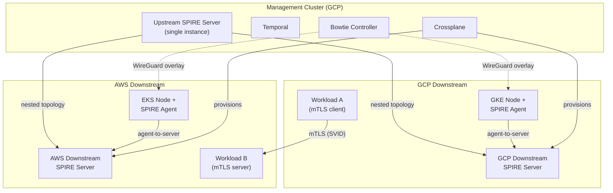

# PoC Architecture

**Scope, Constraints, and Reference Architecture Divergence**

PoC Deployment | March 2026

**Status:** 🔄 In Progress | **Priority:** High

---

## 1. Scope

The PoC deploys a minimal but functional SPIFFE/SPIRE environment across two cloud providers (GCP and AWS) to validate the reference architecture patterns. It covers:

- An upstream SPIRE cluster (single region, reduced instance count)
- Two downstream SPIRE servers: one in GCP, one in AWS
- Bowtie/WireGuard overlay connecting all nodes
- Sample workloads demonstrating cross-platform mTLS
- Temporal workflows orchestrating the full deployment lifecycle
- Failure scenario testing

---

## 2. Architecture Diagram



---

## 3. Reference Architecture Divergence

The PoC intentionally deviates from the reference architecture in several areas to reduce cost and complexity. Each deviation is documented to ensure PoC findings are interpreted correctly.

| Aspect | Reference Architecture | PoC | Rationale |
|---|---|---|---|
| **Upstream HA** | 3 SPIRE servers across 2 DCs with Patroni PostgreSQL | Single SPIRE server with SQLite datastore | HA validation is not a PoC objective. Single instance is sufficient to test nested topology. |
| **Upstream location** | Dedicated on-prem management cluster | GCP GKE cluster (shared with Crossplane/Temporal) | No on-prem infrastructure available for PoC |
| **HSM for root CA** | Required (FIPS 140-2 Level 3) | Software-backed root CA | HSM procurement is not in PoC scope |
| **Azure downstream** | Dedicated Azure downstream | Not included | PoC validates cross-CSP with 2 providers; Azure adds cost without new patterns |
| **On-prem downstream** | Dedicated on-prem downstream | Not included | No on-prem infrastructure in PoC |
| **DMZ segment** | Dedicated DMZ downstream | Not included | DMZ patterns tested conceptually via Bowtie overlay |
| **Node attestation (on-prem)** | TPM / x509pop / join_token | N/A — no on-prem nodes | Cloud-native attestation (`gcp_iit`, `aws_iid`) validates the pattern |
| **Kerberos router** | On-prem migration router | Not included | Requires Kerberos KDC infrastructure |
| **OPA governance** | Full pre-publication pipeline | Kyverno audit mode only | OPA pipeline is a Phase 2 objective |
| **Instance counts** | 2-3 instances per downstream | 1 instance per downstream | Cost optimization for PoC |

---

## 4. Infrastructure Components

| Component | Platform | Provisioned By | Notes |
|---|---|---|---|
| Management cluster | GCP GKE (Standard) | Manual or Terraform | Hosts Crossplane, Temporal, upstream SPIRE, Bowtie controller |
| GCP downstream cluster | GCP GKE (Standard) | Crossplane | Hosts GCP downstream SPIRE server and sample workloads |
| AWS downstream cluster | AWS EKS | Crossplane | Hosts AWS downstream SPIRE server and sample workloads |
| Bowtie overlay | All clusters | Temporal workflow | WireGuard tunnels between all nodes |
| Networking (GCP) | GCP VPC | Crossplane | VPC, subnets, firewall rules (WireGuard UDP) |
| Networking (AWS) | AWS VPC | Crossplane | VPC, subnets, security groups (WireGuard UDP) |
| Cross-CSP connectivity | GCP ↔ AWS | Bowtie overlay over public internet | No VPN/Direct Connect in PoC — overlay handles encryption |

---

## 5. Trust Domain

The PoC uses the same trust domain as the reference architecture: `spiffe://yourorg.com`. SPIFFE ID paths follow the same schema:

```
spiffe://yourorg.com/poc/gcp/demo/workload-a
spiffe://yourorg.com/poc/aws/demo/workload-b
```

The `poc` environment prefix distinguishes PoC identities from any future production identities.

---

## 6. SVID Configuration

| Parameter | Value | Notes |
|---|---|---|
| X.509 SVID TTL | 1 hour | Matches reference architecture |
| JWT-SVID TTL | 5 minutes | Matches reference architecture |
| Agent renewal | 50% TTL (30 min) | Default SPIRE behavior |

---

## 7. Success Criteria

- [ ] Upstream SPIRE server issues intermediate CAs to both downstream servers
- [ ] GCP workload obtains SVID via `gcp_iit` attestation chain
- [ ] AWS workload obtains SVID via `aws_iid` attestation chain
- [ ] Cross-platform mTLS connection succeeds (GCP workload → AWS workload)
- [ ] Bowtie overlay provides authenticated transport for all SPIRE communication
- [ ] Temporal workflow provisions and tears down the entire environment end-to-end
- [ ] Failure scenarios produce the expected behavior documented in the reference architecture
- [ ] Findings document produced with reference architecture update recommendations

---

## 8. Related Documents

- [PoC Overview](index.md)
- [Crossplane Setup](02-crossplane-setup.md) — next step: infrastructure provisioning
- [Trust Domain & Attestation Policy](../reference-architecture/01-trust-domain-and-attestation-policy.md) — identity model
- [Network Overlay Architecture](../reference-architecture/12-network-overlay-architecture.md) — Bowtie overlay design
