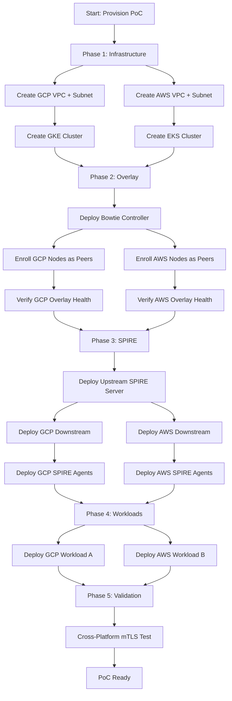

# Temporal Orchestration

**Workflow Design, Spin-Up/Tear-Down, and Failure Handling**

PoC Deployment | March 2026

**Status:** ✅ Complete | **Priority:** Medium

---

## 1. Purpose

This document defines the Temporal workflow design for orchestrating the PoC environment lifecycle. Temporal manages the multi-step provisioning sequence, ensures proper ordering of dependent steps (Bowtie before SPIRE, infrastructure before workloads), handles failures with retry and rollback, and provides a clean tear-down workflow.

---

## 2. Why Temporal

The PoC provisioning sequence has strict ordering dependencies (§3), long-running steps (cluster provisioning takes minutes), and failure modes that require compensating actions. Temporal provides:

- **Durable execution:** Workflows survive process restarts. A provisioning workflow that takes 30 minutes will complete even if the Temporal worker restarts mid-flow.
- **Activity retries:** Individual steps (e.g., "wait for GKE cluster ready") retry automatically with configurable backoff.
- **Compensating transactions:** Tear-down is modeled as the reverse of provisioning, ensuring resources are cleaned up even if provisioning fails partway through.
- **Visibility:** Temporal UI shows workflow state, making it easy to identify where a provisioning run is stuck.

---

## 3. Provisioning Workflow

### 3.1 Workflow Sequence



### 3.2 Phase Details

| Phase | Activities | Timeout | Retry Policy |
|---|---|---|---|
| **1: Infrastructure** | Crossplane claims for VPCs, subnets, firewall rules, GKE/EKS clusters | 20 min per cluster | 3 retries, 60s backoff |
| **2: Overlay** | Bowtie controller deploy, peer enrollment, tunnel health check | 10 min | 5 retries, 30s backoff |
| **3: SPIRE** | Upstream server, downstream servers, agent DaemonSets, registration entries | 10 min per component | 3 retries, 30s backoff |
| **4: Workloads** | Sample workload deployments, SVID verification | 5 min | 3 retries, 15s backoff |
| **5: Validation** | Cross-platform mTLS test, SVID chain validation | 5 min | 2 retries, 10s backoff |

### 3.3 Gate Conditions

Each phase transition is gated on the previous phase's success:

| Gate | Condition | Failure Action |
|---|---|---|
| Infrastructure → Overlay | GKE and EKS clusters report `RUNNING` / `ACTIVE` | Retry cluster creation. If 3 retries fail, abort and tear down. |
| Overlay → SPIRE | WireGuard handshake age < 30s for all peers | Retry peer enrollment. If 5 retries fail, abort and tear down. |
| SPIRE → Workloads | Upstream and all downstream servers report `/ready` 200. Agents have valid SVIDs. | Retry server/agent deployment. |
| Workloads → Validation | Both workloads have valid SVIDs (verified via Workload API fetch) | Retry SVID fetch. Check registration entries. |

---

## 4. Tear-Down Workflow

The tear-down workflow is the reverse of provisioning. It is designed to be idempotent — running tear-down multiple times should not error on already-deleted resources.

### 4.1 Tear-Down Sequence

1. Delete sample workloads (demo namespace)
2. Delete SPIRE agent DaemonSets
3. Delete downstream SPIRE servers
4. Delete upstream SPIRE server
5. Remove Bowtie peers and controller
6. Delete Crossplane claims (triggers cluster and network deletion)
7. Verify all cloud resources are deleted

### 4.2 Failure Handling

If a tear-down step fails (e.g., cloud API rate limit):

- Retry with exponential backoff (3 retries, 60s initial backoff)
- If retries exhausted, log the resource that failed to delete and continue with remaining steps
- Produce a final report listing any resources that require manual cleanup

---

## 5. Temporal Worker Configuration

### 5.1 Worker Deployment

The Temporal worker runs as a deployment on the management cluster alongside the Temporal server:

```yaml
apiVersion: apps/v1
kind: Deployment
metadata:
  name: poc-workflow-worker
  namespace: temporal
spec:
  replicas: 1
  selector:
    matchLabels:
      app: poc-worker
  template:
    spec:
      serviceAccountName: poc-worker
      containers:
        - name: worker
          image: <your-registry>/poc-workflow-worker:latest
          env:
            - name: TEMPORAL_HOST
              value: "temporal-frontend.temporal.svc.cluster.local:7233"
            - name: TEMPORAL_NAMESPACE
              value: "poc"
            - name: TEMPORAL_TASK_QUEUE
              value: "poc-provisioning"
```

### 5.2 Activity Implementations

| Activity | Implementation | External Dependency |
|---|---|---|
| `CreateInfrastructure` | Apply Crossplane claims via `kubectl apply` | Crossplane + cloud APIs |
| `WaitForClusterReady` | Poll cluster status via Crossplane status conditions | Crossplane |
| `DeployBowtieOverlay` | Apply Bowtie manifests, enroll peers | Bowtie controller API |
| `VerifyOverlayHealth` | Check WireGuard handshake age via Bowtie API | Bowtie |
| `DeploySPIREServer` | Apply SPIRE server manifests | Kubernetes API |
| `WaitForSPIREReady` | Poll SPIRE server `/ready` endpoint | SPIRE server |
| `DeploySPIREAgents` | Apply DaemonSet manifests | Kubernetes API |
| `VerifyAgentSVID` | Fetch SVID via Workload API from agent pod | SPIRE agent |
| `DeployWorkloads` | Apply workload manifests and registration entries | Kubernetes + SPIRE API |
| `RunMTLSTest` | Execute cross-platform mTLS connection test | Workload pods |

---

## 6. Workflow Execution

### 6.1 Start Provisioning

```bash
temporal workflow start \
  --task-queue poc-provisioning \
  --type ProvisionPoC \
  --namespace poc \
  --workflow-id poc-provision-001
```

### 6.2 Monitor Progress

```bash
temporal workflow describe --workflow-id poc-provision-001 --namespace poc
```

Or use the Temporal UI at `http://temporal-web.temporal.svc.cluster.local:8080`.

### 6.3 Start Tear-Down

```bash
temporal workflow start \
  --task-queue poc-provisioning \
  --type TearDownPoC \
  --namespace poc \
  --workflow-id poc-teardown-001
```

---

## 7. Related Documents

- [PoC Architecture](01-poc-architecture.md) — PoC scope and deployment topology
- [Crossplane Setup](02-crossplane-setup.md) — infrastructure provisioning via Crossplane
- [Network Overlay Architecture](../reference-architecture/12-network-overlay-architecture.md) — Bowtie overlay bootstrap sequence
- [Failure Scenario Testing](07-failure-scenario-testing.md) — test scenarios executed after provisioning
