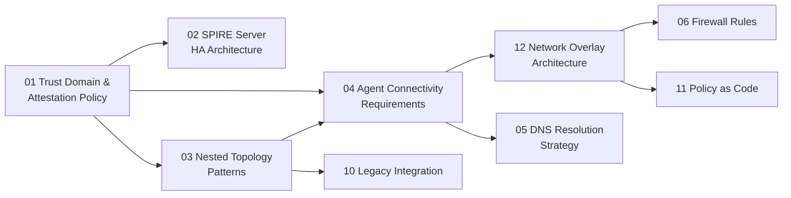

# Reading Order Guide

This guide provides structured reading paths based on your role and goals. The documents build on each other — reading out of order will leave gaps in the conceptual model.

---

## If you are new to SPIFFE/SPIRE

Start here to build the conceptual foundation before reading any design documents.

1. [SPIFFE/SPIRE official concepts](https://spiffe.io/docs/latest/spiffe-about/spiffe-concepts/) — external link
2. [01 — Trust Domain & Attestation Policy](reference-architecture/01-trust-domain-and-attestation-policy.md) §1–3 — trust domains and the single trust domain decision
3. [01 — Trust Domain & Attestation Policy](reference-architecture/01-trust-domain-and-attestation-policy.md) §4 — SPIFFE ID naming and what goes in the path
4. [01 — Trust Domain & Attestation Policy](reference-architecture/01-trust-domain-and-attestation-policy.md) §5 — attestation plugins and SVID lifetimes
5. [03 — Nested Topology Patterns](reference-architecture/03-nested-topology-patterns.md) §2 — nested servers vs. SPIFFE federation (the distinction matters early)

---

## If you are evaluating the architecture

Read the design decisions and their rationale without getting into implementation detail.

1. [Home](index.md) — Design Decisions Log (the summary table)
2. [01 — Trust Domain & Attestation Policy](reference-architecture/01-trust-domain-and-attestation-policy.md) — full document
3. [03 — Nested Topology Patterns](reference-architecture/03-nested-topology-patterns.md) — §2 (nested vs. federation) and §4 (trust chain)
4. [02 — SPIRE Server HA Architecture](reference-architecture/02-spire-server-ha-architecture.md) — HA cluster design and recovery budgets

---

## If you are implementing — cloud infrastructure

1. [01 — Trust Domain & Attestation Policy](reference-architecture/01-trust-domain-and-attestation-policy.md) — full document (decisions that constrain everything else)
2. [02 — SPIRE Server HA Architecture](reference-architecture/02-spire-server-ha-architecture.md) — upstream HA cluster
3. [03 — Nested Topology Patterns](reference-architecture/03-nested-topology-patterns.md) — full document (downstream server design)
4. [04 — Agent Connectivity Requirements](reference-architecture/04-agent-connectivity-requirements.md) — ports, protocols, per-segment matrix
5. [12 — Network Overlay Architecture](reference-architecture/12-network-overlay-architecture.md) — Bowtie/WireGuard overlay resolves DMZ and cross-CSP connectivity
6. [05 — DNS Resolution Strategy](reference-architecture/05-dns-resolution-strategy.md) — FQDN strategy before configuring agents
7. [06 — Firewall Rules](reference-architecture/06-firewall-rules.md) — rule templates per segment (underlay simplified by overlay)
8. [07 — SPIRE Agent Deployment](reference-architecture/07-spire-agent-deployment.md) — agent rollout per platform

---

## If you are implementing — on-premises / bare metal

The on-premises path has additional complexity around node attestation and TPM availability.

1. [01 — Trust Domain & Attestation Policy](reference-architecture/01-trust-domain-and-attestation-policy.md) §5.1 — on-prem node attestation options and the TPM requirement
2. [03 — Nested Topology Patterns](reference-architecture/03-nested-topology-patterns.md) — full document, with attention to §3.2 (bootstrap credential options for on-prem)
3. [04 — Agent Connectivity Requirements](reference-architecture/04-agent-connectivity-requirements.md) §4.4 — on-prem internal connectivity
4. [05 — DNS Resolution Strategy](reference-architecture/05-dns-resolution-strategy.md) §Phase 4 — CoreDNS on on-prem Kubernetes

---

## If you are a security reviewer

Focus on the security model, trust chain, and failure scenarios.

1. [01 — Trust Domain & Attestation Policy](reference-architecture/01-trust-domain-and-attestation-policy.md) §5–6 — attestation selectors and policy enforcement
2. [03 — Nested Topology Patterns](reference-architecture/03-nested-topology-patterns.md) §3 (bootstrap security), §4 (trust chain and CA key storage), §5 (failure behavior)
3. [12 — Network Overlay Architecture](reference-architecture/12-network-overlay-architecture.md) §3 (Bowtie/SPIRE dual identity model), §6 (three-layer policy architecture)
4. [09 — Failure Modes & Runbooks](reference-architecture/09-failure-modes-and-runbooks.md) — blast radius analysis
5. [11 — Policy as Code](reference-architecture/11-policy-as-code.md) — admission control enforcement

---

## If you are running the PoC

1. [PoC Overview](poc/index.md) — objectives and what the PoC proves
2. [01 — PoC Architecture](poc/01-poc-architecture.md) — where the PoC diverges from the reference architecture
3. [02 — Crossplane Setup](poc/02-crossplane-setup.md) — start here for implementation
4. Then follow the numbered PoC documents in sequence

---

## Document Dependency Map

### Edge rationale

| From | To | Rationale |
|---|---|---|
| 01 | 02 | HA recovery budgets derived from SVID TTLs in §5.3 |
| 01 | 03 | Trust domain model constrains downstream design |
| 01 | 04 | Attestation policy determines which ports/protocols agents need |
| 03 | 04 | DMZ topology from Phase 2 closes connectivity gap |
| 04 | 12 | Resolves DMZ + cross-CSP blockers identified in 04 |
| 12 | 06 | Underlay simplifies to WireGuard UDP |
| 12 | 11 | Three-layer policy model: Kyverno + Bowtie + OPA |
| 04 | 05 | DNS outputs feed back into connectivity matrix |
| 03 | 10 | JWT-SVID TTL from §5.3 applies to legacy integrations |
