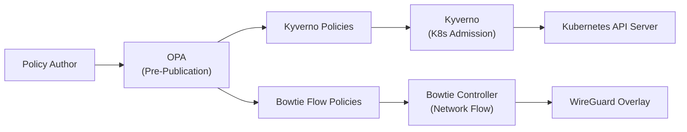
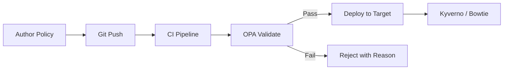

# Policy as Code

**Kyverno, OPA, and Admission Control Strategy**

Workload Identity | March 2026

**Status:** ✅ Complete | **Priority:** Medium

**Scope:** Connected infrastructure only. Air-gapped/isolated segments are addressed separately.

**Depends on:** [Network Overlay Architecture](12-network-overlay-architecture.md) (three-layer policy model), [Trust Domain & Attestation Policy](01-trust-domain-and-attestation-policy.md)

---

## 1. Purpose

This document defines the policy-as-code strategy for the SPIRE workload identity infrastructure. It implements the three-layer policy architecture established in [Network Overlay Architecture](12-network-overlay-architecture.md) §6:

1. **Kyverno** — Kubernetes admission control (runtime)
2. **Bowtie engine** — network flow enforcement (runtime)
3. **OPA** — pre-publication governance (pipeline)

Each layer has a distinct responsibility, enforcement point, and failure mode. This document details the policies, configuration, and operational model for each layer.

---

## 2. Three-Layer Policy Architecture

### 2.1 Architecture Diagram



### 2.2 Layer Responsibilities

| Layer | Tool | Enforcement Point | When It Runs | Failure Mode |
|---|---|---|---|---|
| Pre-publication governance | OPA | CI/CD pipeline gate | Before deployment | Policy rejected — not published |
| K8s admission control | Kyverno | Kubernetes API server | Runtime — on API request | Pod/resource creation denied |
| Network flow enforcement | Bowtie engine | Bowtie controller | Runtime — on packet flow | Network connection blocked |

**These layers do not overlap.** OPA never makes runtime decisions. Kyverno never evaluates network flows. Bowtie never evaluates Kubernetes admission requests. This separation eliminates policy conflict between tools and ensures each tool operates in its area of expertise.

---

## 3. Kyverno — Kubernetes Admission Control

### 3.1 Why Kyverno

**Decision:** Kyverno is the Kubernetes admission controller for SPIRE-related policies.

Rationale:
- Kyverno policies are Kubernetes-native (CRDs), making them familiar to platform teams
- Policies are expressed as YAML, not a separate policy language (unlike OPA/Rego for admission control)
- Kyverno supports validate, mutate, and generate policy types — all needed for SPIRE
- Kyverno's audit mode allows policy testing before enforcement

### 3.2 SPIRE-Specific Kyverno Policies

#### Policy 1: Require Workload API Socket Mount

Ensure all pods that need SVID access mount the SPIRE agent Workload API socket.

```yaml
apiVersion: kyverno.io/v1
kind: ClusterPolicy
metadata:
  name: require-spire-socket-mount
  annotations:
    policies.kyverno.io/title: Require SPIRE Workload API Socket
    policies.kyverno.io/description: >-
      Pods in namespaces labeled with spire-enabled=true must mount
      the SPIRE agent Workload API socket.
spec:
  validationFailureAction: Enforce
  background: true
  rules:
    - name: check-spire-socket
      match:
        any:
          - resources:
              kinds:
                - Pod
              namespaceSelector:
                matchLabels:
                  spire-enabled: "true"
      validate:
        message: "Pods in SPIRE-enabled namespaces must mount the Workload API socket at /run/spire/sockets/agent.sock"
        pattern:
          spec:
            containers:
              - volumeMounts:
                  - mountPath: "/run/spire/sockets"
```

#### Policy 2: Restrict SPIRE Agent DaemonSet Privileges

Ensure the SPIRE agent DaemonSet has the required (and only the required) security context.

```yaml
apiVersion: kyverno.io/v1
kind: ClusterPolicy
metadata:
  name: validate-spire-agent-security
  annotations:
    policies.kyverno.io/title: Validate SPIRE Agent Security Context
    policies.kyverno.io/description: >-
      SPIRE agent DaemonSet must have hostNetwork, hostPID, and the
      system-node-critical priority class. Other DaemonSets must NOT
      have these privileges.
spec:
  validationFailureAction: Enforce
  rules:
    - name: spire-agent-requires-host-access
      match:
        any:
          - resources:
              kinds:
                - DaemonSet
              names:
                - spire-agent
              namespaces:
                - spire
      validate:
        message: "SPIRE agent DaemonSet must have hostNetwork and hostPID"
        pattern:
          spec:
            template:
              spec:
                hostNetwork: true
                hostPID: true
                priorityClassName: system-node-critical
    - name: deny-host-access-others
      match:
        any:
          - resources:
              kinds:
                - DaemonSet
      exclude:
        any:
          - resources:
              names:
                - spire-agent
              namespaces:
                - spire
      validate:
        message: "Only the SPIRE agent DaemonSet is permitted hostNetwork and hostPID"
        deny:
          conditions:
            any:
              - key: "{{ request.object.spec.template.spec.hostNetwork }}"
                operator: Equals
                value: true
```

#### Policy 3: Enforce Container Image Digest

Ensure workloads in SPIRE-enabled namespaces use image digests (not tags) to align with the image digest attestation selector requirement from [Trust Domain & Attestation Policy](01-trust-domain-and-attestation-policy.md) §6.1.1.

```yaml
apiVersion: kyverno.io/v1
kind: ClusterPolicy
metadata:
  name: require-image-digest
  annotations:
    policies.kyverno.io/title: Require Container Image Digest
    policies.kyverno.io/description: >-
      Containers in SPIRE-enabled namespaces must reference images
      by digest (@sha256:...) to match SPIRE registration entry selectors.
spec:
  validationFailureAction: Enforce
  rules:
    - name: check-image-digest
      match:
        any:
          - resources:
              kinds:
                - Pod
              namespaceSelector:
                matchLabels:
                  spire-enabled: "true"
      validate:
        message: "Container images must use digest references (@sha256:...) in SPIRE-enabled namespaces"
        pattern:
          spec:
            containers:
              - image: "*@sha256:*"
```

#### Policy 4: Restrict SPIRE Namespace Access

Prevent non-SPIRE workloads from being deployed in the `spire` namespace.

```yaml
apiVersion: kyverno.io/v1
kind: ClusterPolicy
metadata:
  name: restrict-spire-namespace
spec:
  validationFailureAction: Enforce
  rules:
    - name: deny-non-spire-pods
      match:
        any:
          - resources:
              kinds:
                - Pod
              namespaces:
                - spire
      exclude:
        any:
          - resources:
              selector:
                matchLabels:
                  app.kubernetes.io/part-of: spire
      validate:
        message: "Only SPIRE components may run in the spire namespace"
        deny: {}
```

### 3.3 Policy Deployment

- **Audit mode first:** All new policies are deployed in `validationFailureAction: Audit` mode for a minimum of 1 week before switching to `Enforce`. Audit results are reviewed for false positives.
- **Cluster scope:** Policies are deployed as `ClusterPolicy` resources (not namespace-scoped) for consistent enforcement across all namespaces.
- **GitOps delivery:** Kyverno policies are stored in the infrastructure repository and deployed via the GitOps pipeline (ArgoCD, Flux, or equivalent).

---

## 4. Bowtie Engine — Network Flow Enforcement

### 4.1 Role

The Bowtie engine evaluates network flows against published flow intent policies at runtime. It operates at the Bowtie controller level, inspecting WireGuard overlay traffic and permitting or denying connections based on policy.

### 4.2 SPIRE-Related Flow Policies

The flow intent policies for SPIRE traffic are defined in [Firewall Rules](06-firewall-rules.md) §3. Key policies:

| Policy | Source → Destination | Purpose |
|---|---|---|
| `spire-agent-to-server` | Agents → downstream server (per segment) | SVID issuance and renewal |
| `spire-downstream-to-upstream` | Downstream servers → upstream cluster | Trust bundle sync, CA signing |
| `spire-health-monitoring` | Monitoring → SPIRE endpoints | Prometheus scraping |
| `spire-admin-api` | Admin → SPIRE servers | Registration entry management |

### 4.3 Policy Authoring

Bowtie flow intent policies express connectivity intent in terms of peer groups and permitted flows. The security team defines:

- **Peer groups:** logical groupings of nodes by function (e.g., `spire-agents-gcp`, `spire-downstream-servers`, `monitoring-systems`)
- **Flow intents:** permitted connections between peer groups (source group, destination group, port, protocol)

Policies are authored in Bowtie's native format and must pass OPA pre-publication validation before being deployed to controllers.

---

## 5. OPA — Pre-Publication Governance

### 5.1 Role

OPA operates upstream of both Kyverno and Bowtie. It validates policies before they are published to their respective enforcement points. OPA is never in the data path — it adds no latency to runtime operations.

### 5.2 What OPA Validates

#### For Kyverno Policies

| Check | Description |
|---|---|
| **Schema validation** | Policy YAML conforms to Kyverno CRD schema |
| **Naming convention** | Policy names follow the organizational naming standard |
| **Audit-before-enforce** | New policies must start in `Audit` mode (not `Enforce`) |
| **No wildcard matches** | Policies must not match all namespaces or all resource types without explicit justification |
| **SPIRE namespace protection** | Changes to policies affecting the `spire` namespace require security team approval |

#### For Bowtie Flow Policies

| Check | Description |
|---|---|
| **No open egress** | Policies must not permit unrestricted outbound access from any peer group |
| **Port restriction** | Permitted ports must be from the approved list (8081, 8080, 51820 for SPIRE) |
| **No cross-environment flows** | Production peer groups cannot be granted access to staging peer groups and vice versa |
| **Admin API restriction** | Admin API access policies can only reference the approved admin peer group |
| **Conflict detection** | New policies do not conflict with or shadow existing policies |

### 5.3 OPA Pipeline Integration



OPA validation is a CI/CD pipeline gate:

1. Policy author pushes a policy change to the Git repository
2. CI pipeline triggers OPA validation against the policy rule set
3. If validation passes, the policy is deployed to the target (Kyverno cluster or Bowtie controller)
4. If validation fails, the pipeline reports the specific rule violations and blocks deployment

### 5.4 OPA Policy Language

OPA policies are written in Rego. Example rule for the "no open egress" check on Bowtie flow policies:

```rego
package bowtie.policy.validation

deny[msg] {
    input.flow.destination_group == "*"
    msg := sprintf("Flow policy '%s' permits unrestricted destination access. Specify a target peer group.", [input.flow.name])
}

deny[msg] {
    input.flow.destination_port == "*"
    msg := sprintf("Flow policy '%s' permits all ports. Specify allowed ports.", [input.flow.name])
}

deny[msg] {
    contains(input.flow.source_group, "prod")
    contains(input.flow.destination_group, "staging")
    msg := sprintf("Flow policy '%s' creates a cross-environment path from production to staging.", [input.flow.name])
}
```

---

## 6. Policy Lifecycle

### 6.1 Authoring and Review

| Step | Action | Owner |
|---|---|---|
| 1 | Author policy in Git repository | Platform or Security team |
| 2 | Open pull request | Author |
| 3 | Automated OPA validation runs in CI | CI pipeline |
| 4 | Peer review (minimum 1 reviewer from security team for SPIRE-related policies) | Security team |
| 5 | Merge to main branch | Author (after approval) |
| 6 | GitOps pipeline deploys policy to target | Automated |

### 6.2 Emergency Policy Changes

For time-critical security responses (e.g., blocking a compromised peer group):

1. Security team applies the policy change directly to the Bowtie controller or Kyverno cluster
2. Change is immediately effective
3. The change must be backfilled into the Git repository within 24 hours
4. Post-incident review validates the change against OPA rules retroactively

### 6.3 Policy Retirement

When a policy is no longer needed (e.g., a segment is decommissioned):

1. Switch the policy to `Audit` mode for 1 week to confirm no active traffic matches
2. Remove the policy from Git
3. GitOps pipeline removes the policy from the target

---

## 7. Monitoring and Compliance

### 7.1 Kyverno Policy Reports

Kyverno generates `PolicyReport` and `ClusterPolicyReport` resources that record policy evaluation results. These should be:

- Scraped by the monitoring stack per [Observability](08-observability.md)
- Alerted on for `fail` results in `Enforce` mode (indicates blocked deployments)
- Reviewed weekly for `fail` results in `Audit` mode (indicates policy violation candidates)

### 7.2 Bowtie Policy Metrics

Bowtie controllers report flow decisions (permit/deny) as metrics. These should be:

- Scraped by Prometheus per [Observability](08-observability.md) §5.3
- Alerted on for unexpected deny decisions (may indicate misconfigured policy or unauthorized access attempts)
- Reviewed monthly for policy coverage (are there flows not covered by any policy?)

### 7.3 OPA Audit Trail

Every OPA validation decision (pass/fail) is logged in the CI pipeline. The audit trail includes:

- Policy file path
- Validation result (pass/fail)
- Specific rule violations (if any)
- Author and timestamp

---

## 8. Open Items

| Priority | Item | Owner |
|---|---|---|
| **High** | Define the complete Rego rule set for Bowtie flow policy validation | Security team |
| **High** | Validate Kyverno policies in PoC environment (audit mode) | Platform team |
| **Medium** | Establish the OPA CI/CD pipeline (conftest or OPA CLI integration) | Platform + CI/CD team |
| **Medium** | Define the emergency policy change procedure with security team sign-off | Security team |
| **Low** | Evaluate Kyverno policy exception mechanism for legitimate edge cases | Platform + Security team |

---

## 9. Related Documents

- [Network Overlay Architecture](12-network-overlay-architecture.md) — three-layer policy model (§6) that this document implements
- [Trust Domain & Attestation Policy](01-trust-domain-and-attestation-policy.md) — attestation selectors that Kyverno policies enforce at admission time
- [Firewall Rules](06-firewall-rules.md) — Bowtie flow intent policies are defined there; this document covers governance
- [SPIRE Agent Deployment](07-spire-agent-deployment.md) — DaemonSet security context validated by Kyverno
- [Observability](08-observability.md) — policy evaluation metrics and alerting
